<!--
 * @Author: Haonan Mei
 * @Date: 2022-08-02 11:00:42
 * @LastEditTime: 2023-01-19 15:52:22
 * @LastEditors: Haonan Mei
 * @Description: 
 * @FilePath: \undefinedd:\leslie\ra\danqingmei\00_settings\docs\README.md
-->

# GPU云服务器配置文档

[TOC]

## 写在前面
你在参考这份文档时，可能有需求上的变化，可以利用本文档熟悉整个过程后，根据实际情况自行调整；
作者水平有限，如果有更好的实现方案，欢迎fork该文档源码修改！[Github Repo](https://github.com/LeslieMei/cloud_server_settings_doc)

## 整体思路

### 服务器选择

在选择云服务器平台时，我主要参考了以下几个标准：
- 配置：支持GPU，内存16G+（前两者固定后，CPU核心一般也就确定了，各家云平台提供的配置类似）；
- 计费方式：因为程序通常需要在一段时间内集中大量处理，因此最好支持按时按量计费；
- 稳定：尽量选择大厂；

综合以上要素，我选择了腾讯云GPU云服务器；系统上，我按照习惯选择了 Ubuntu 20.04，后续的一系列配置均在 Ubuntu 的命令行（CLI）上完成，如果你对CLI，Git，Vim不太了解，可能需要花一点点时间了解一下，方便后续在命令行上进行工作。
> 这里推荐看[MIT-Missing-Semester](https://missing.csail.mit.edu/2020/) 作为快速熟悉和入门，具体的命令用到再查完全可以.

### 开发环境配置
在配置时，主要有以下库需要安装：
- Python常用库（pip, numpy, pandas, matplotlib, etc.）
- NLP系列环境：CUDA, Pytorch, Sentence BERT

以上部分最麻烦的是**Nvidia显卡驱动**和**CUDA**的配置。

注意在配置过程中最好不要使用 Ubuntu 的 `sudo apt-get update` 和 `sudo apt-get upgrade`更新，更新后的 linux kernel 似乎会使 Nvidia显卡驱动不可用。我也尝试过卸载原有的Nvidia显卡驱动，并在新kernel下安装更高版本的驱动和CUDA，但并没有成功（云服务器上的安装和自己本地安装似乎有区别）。

如果你对这方面很了解，有更好的方案或者安装成功，或者腾讯云提供的初始Nvidia驱动版本已经更新，欢迎修改本文档；如果没有的话，本着**尽快投入战斗**的原则，可以遵循该文档继续往下配置，毕竟让程序跑起来是第一要务hh！

### 服务器复用
因为腾讯云服务器每次选择**不收费关机**后，由于处理器，内存和IP被释放了，就很难再稳定开启，因此我选择制作一个系统镜像，每次需要使用服务器时，就安装该镜像创建一个实例，节省了前面繁琐的环境配置过程，之后再将代码和数据传上服务器去跑。

## 新建服务器实例
1. 进入腾讯云官网后，注册一个账号并登录，找到并进入GPU云服务器链接
   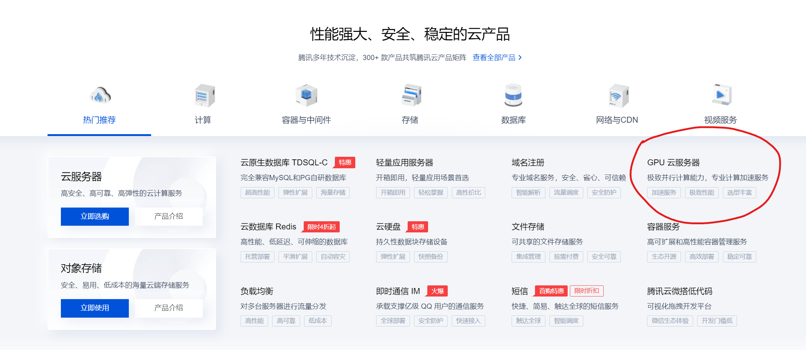

2. 选择一款GPU服务器，进入立即购买，具体配置可以在后续过程中选择，此处我们选择'GN'型号
   

3. 配置选择（此处只列出重要/需要修改的配置）
   - 基础配置：注意这里的地域和分区，最好选择一个固定的分区（记住），因为目前腾讯云上的镜像和快照不能跨区使用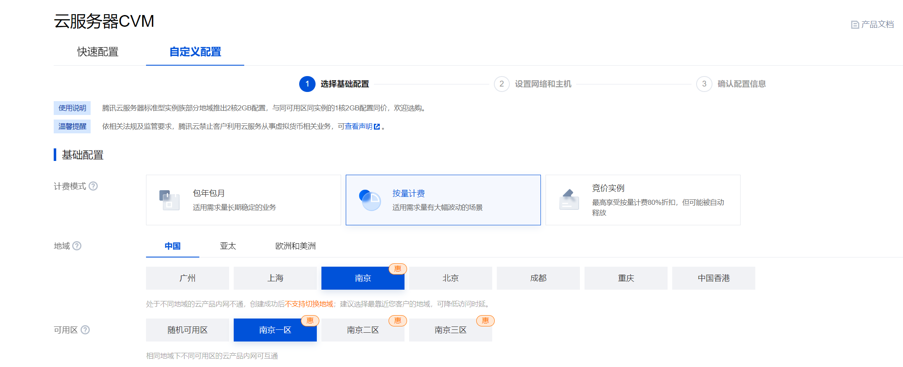
   - 实例配置：实例族方面选择GPU机型，如果你是初次尝试，可以选择最基础（便宜）的机型，这里可以看到，这一配置其实也很够用了，如果有更大规模的模型要跑，后续可以选择更高配置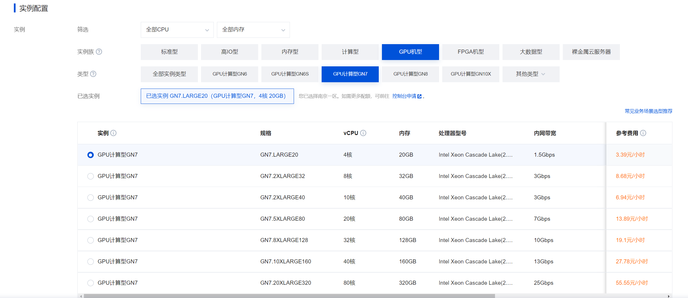
   - 系统配置：如果你是初次配置，只能选择公共镜像里的 Ubuntu 20.04，如果你已经按照整个文档制作好了镜像，就可以直接使用镜像系统；这里选择完就可以进入下一页配置了
   - 网络配置：宽带选择按流量计费，带宽初始可以选小一点，熟悉之后再增加，安全组部分，新建并保持默认即可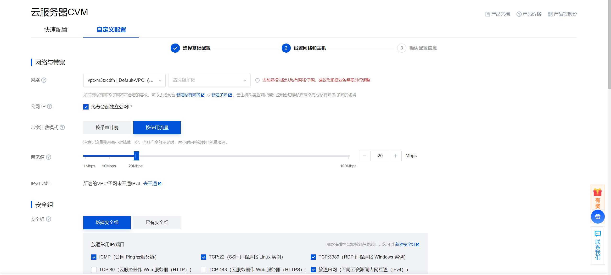
   - 其他配置：设置好实例名称和密码，记住系统的登录名为ubuntu，然后创建实例即可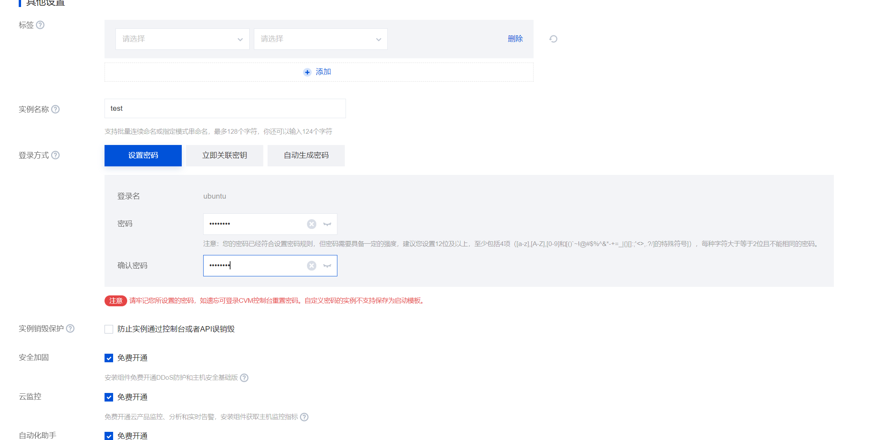 

## 配置开发环境
接下来的开发环境配置，将利用腾讯云提供的云终端演示完成，如果你有mac/linux系统的主机，也可以直接ssh远程登陆完成。

### Log In
1. 进入创建好的实例，找到左上角的‘登录’
2. 输入密码登录，密码为‘其他配置’中设置的密码
3. 进入终端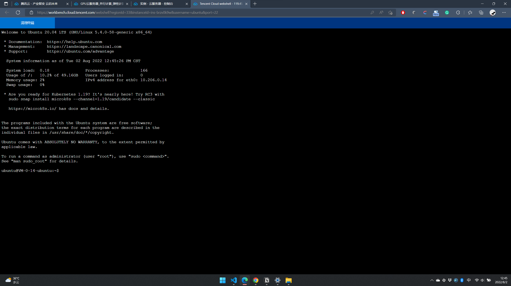
   > 如果你有mac/linux系统的主机，也可以直接在本机的终端`ssh ubuntu@{实例公网IP}`，再输入密码后登录
4. 查看系统配置版本：
   - Python 版本：在命令行键入 `python -v`
   - Nvidia 显卡驱动版本：`nvidai-smi`
   这里请注意，此前提过的“**不要使用 Ubuntu 的 `sudo apt-get update` 和 `sudo apt-get upgrade`更新**”，是因为更新后会使`nvidai-smi`不可用；
   这里的`Driver Version`就是这台服务器上的显卡驱动版本，而右侧的`CUDA Version`是指这一版本的显卡驱动所支持的最高的CUDA版本，网络上很多教程认为这里是本机的CUDA版本是有问题的，因为此时服务器上并没有安装CUDA，无论是`nvcc -V`还是`cat /usr/local/cuda/version.txt`都是没有结果的。

如前文所说，我一开始尝试了卸载这一版本的显卡驱动，去安装更新版本的驱动，CUDA和Pytorch，不过没有成功，所以后面就在这一默认驱动基础上，安装最高支持的CUDA 11.0和对应版本的Pytorch。如果你的驱动配置已经改变，安装对应版本的CUDA和Pytorch即可。CUDA是可以向下兼容的，比如你安装了11.0的CUDA，可以安装CUDA10.2对应的Pytorch。

### CUDA
> 这一部分同时可以参考[腾讯云官方文档](https://cloud.tencent.com/document/product/560/8064) 

1. 访问[Nvidia CUDA Archive](https://developer.nvidia.com/cuda-toolkit-archive)，找到自己要安装的CUDA版本并进入，这里我们进入11.0版本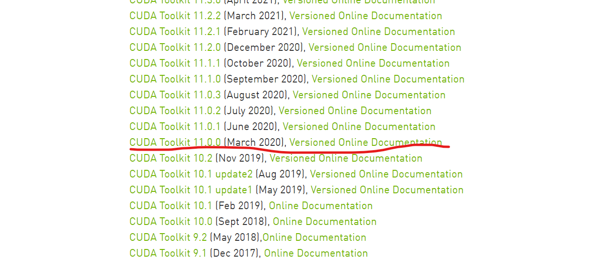
2. 进入后按下图选择配置
3. - 将两行命令分别复制粘贴到终端运行（Ubuntu Shell粘贴为Ctrl+Shift+v）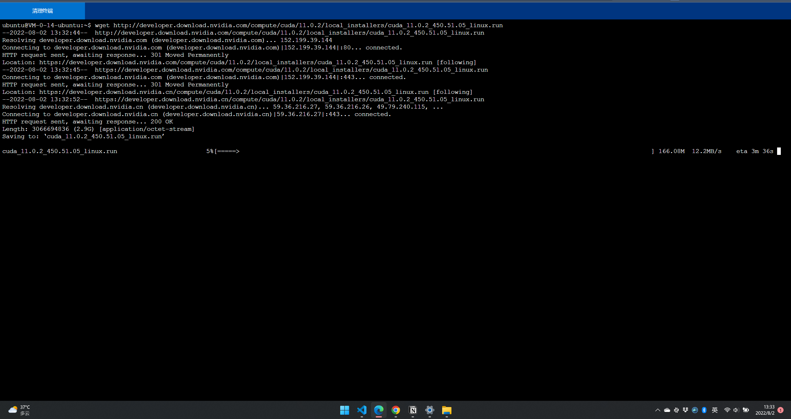
      > 如果wget停在conceted过久，可以Ctrl+c打断后重新运行
   
   - 运行第二行命令时会进入这个界面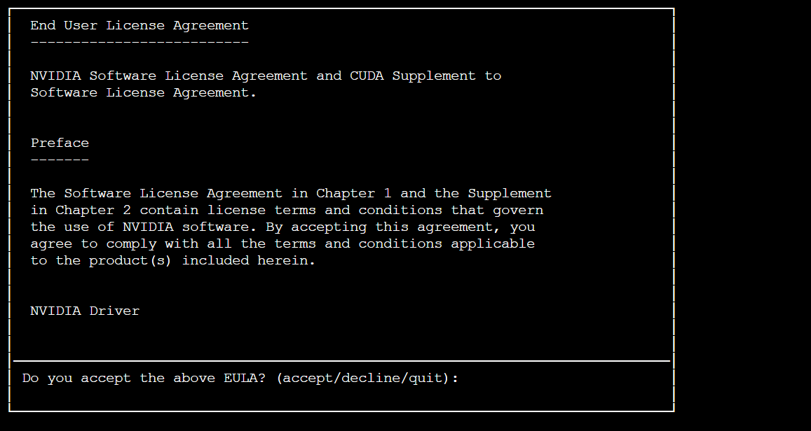
   
   - 键入accept，回车进入
   
   - 可以看到Driver前面是X，表示显卡驱动也在安装列表，但本机已经有驱动了，所以按下回车取消选中，移动选中行到Install上，回车安装
4. 重启服务器后再次登录
5. 配置环境变量，运行以下命令
   1. `echo 'export PATH=/usr/local/cuda/bin:$PATH' | sudo tee /etc/profile.d/cuda.sh`
   2. `source /etc/profile`
   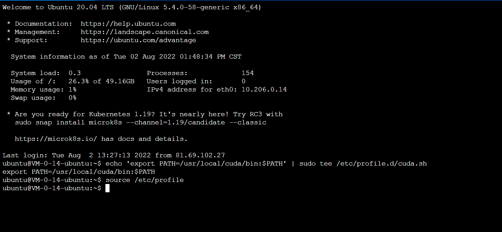
6. 检查安装是否成功，运行以下命令，如返回结果显示 Result=PASS，则表示 CUDA 安装成功。如果失败可以参考前文腾讯云文档。此时运行`nvcc -V`, 可以看到CUDA版本
   1. `cd /usr/local/cuda-11.0/samples/1_Utilities/deviceQuery`
   2. `sudo make`
   3. `./deviceQuery`
   

### Pytorch
你可以选择自己需要的pytorch版本，我们要安装对应CUDA 11.0 版本的Pytorch
1. 安装pip：`sudo apt install python3-pip`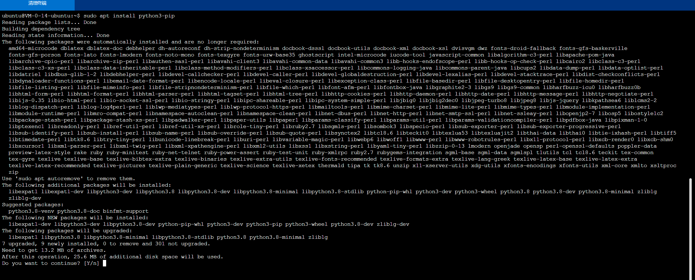
2. 安装pytorch：进入pytorch历史版本[官网](https://pytorch.org/get-started/previous-versions/)，找到自己需要的版本命令，在终端运行即可。
   如果官网安装太慢，也可以尝试镜像源（我第一次安装很快就成功了，但第二次就因为太慢使用了镜像源，感觉是薛定谔的网速）`pip install torch==1.7.1 torchvision==0.8.2 torchaudio==0.7.2 -i https://pypi.tuna.tsinghua.edu.cn/simple`但是这里安装的是cuda 10.2版本下的Pytorch 1.7.1，而不是cuda 11.0下的，因为前者的镜像源好像没有，不过好在不影响使用。
3. 进入python后输入以下命令，检查安装是否成功，且CUDA是否可用

> 关于以上安装CUDA和Pytorch，理论上用conda也可以很方便的完成。但考虑到conda的安装和配置源也需要一定的步骤，且过程中可能要用到Vim编辑，所以笔者直接采用了pip安装（基本上复制粘贴就行）。如果你尝试了使用conda完成了安装过程，欢迎直接在本文档上增加。

### Sentence BERT
1. 安装：在命令行键入`pip install -U sentence-transformers`即可
2. 复制[官网](https://www.sbert.net/index.html)首页的命令，看看能否运行即可，第一次导入可能会比较慢。

### Python Packages
同样用`pip install numpy pandas matplotlib ... `即可

## 保存系统镜像并复用

1. 选择制作镜像
   
2. 填写备注信息，尽量写清楚系统，安装了哪些包，和包的版本等等
   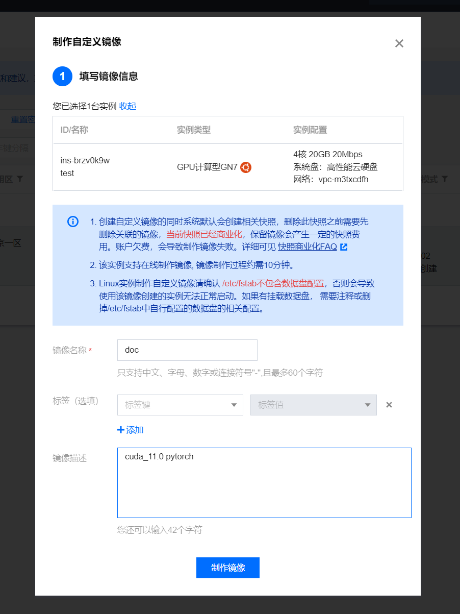
3. 创建镜像，等待镜像制作完成即可
   
4. 每次使用完服务器，将跑出的数据文件和结果传输到自己的电脑上后，可以直接选择销毁，因为就在当前情况下，就算选择不收费关机，也很难稳定的再次开机；而如果选择继续收费关机，就会空闲很多资源，除非你确认在短时间内（比如几个小时？）会再次使用，总之权衡一下即可。
5. 再次使用时，按照之前的步骤创建服务器实例即可，只有一点需要注意，在选择系统镜像时，在自定义中选择自己制作的系统镜像即可。安装开机后可以同上测试那些程序能否正常运行。

## 文件和数据传输
1. 如果你是Mac/Linux用户，学习一下`scp`命令，在命令行用`scp`完成文件传输即可
2. 如果你是Windows用户，参考一下知乎，安装一个Filezilla Client，用来传输文件即可。这是一个图形化界面，连上服务器后，用鼠标拖动传输即可

### 测试
测试默认以上服务器配置已经完成

1. 创建本地脚本 

2. 远程连接服务器并传输文件: 通过filezilla传输 
   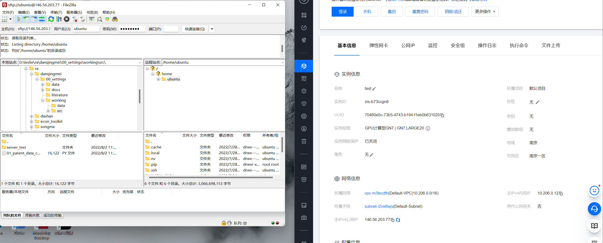 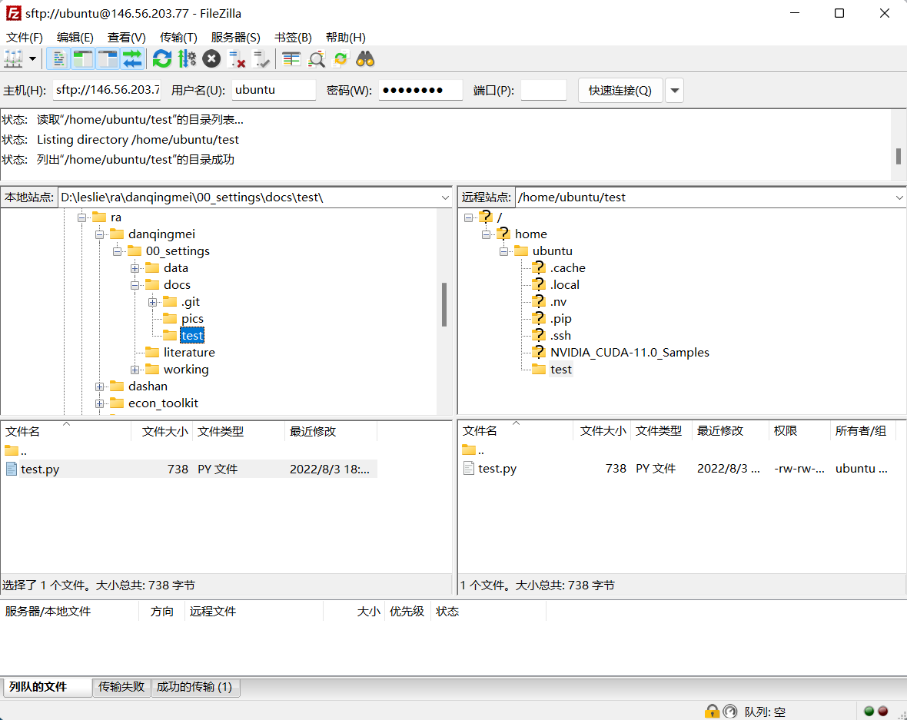

3. (optional) 终端预览脚本：通过Vim预览 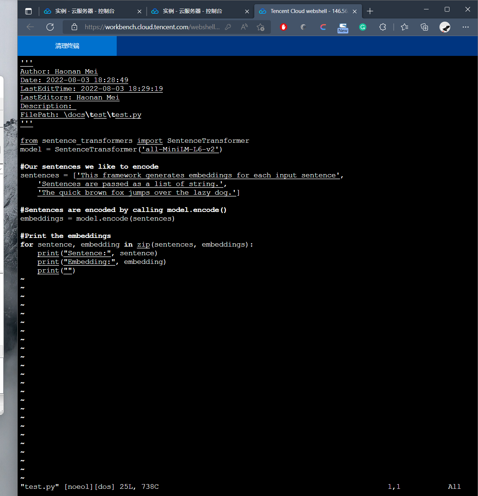

4. 运行测试脚本并输出结果：通过`python {script_name}`运行 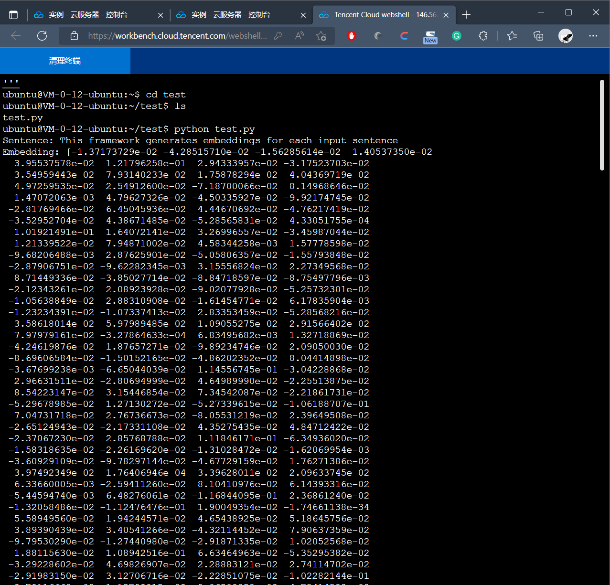

## 云硬盘


### 挂载
1. 在左侧导航栏找到 “储存与快照“， 进入云硬盘，选中该数据盘并挂载到你创建的实例上；
2. 进入云主机的命令行界面，键入`sudo fdisk -l`，查看本机的硬盘状况，通常最后一个`/dev/vdb`就是我们刚刚挂载上的硬盘；

> #### 初始化
> 对格式化字眼保持警惕，不要轻易对硬盘进行格式化，除非你知道自己在干嘛！
> 这里是指第一次挂载硬盘时，需要在硬盘创建一个文件格式系统，类似于u盘或者移动硬盘格式化，以针对不同的系统选则不同的文件格式。如果这个硬盘以前已经使用过，或者已存数据/文件在硬盘上，请谨慎进行这一步操作。
> ```
> lsblk  -f
> ```
> 以上这一步可以用来check硬盘是否有文件系统，即是否需要格式化。如果硬盘对应名称（通常是/dev/vdb）在第二列显示`FSTYPE`为空，则需要进行格式化。
>
> ```
> mkfs -t ext4 /dev/vdb
> ```
> 这一步可以用来设置文件系统，这里以`ext4`文件系统为例，如果是其它系统则可能需要设置其他的操作系统，如`ntfs`或`fat`。

3. 键入`sudo mount /dev/vdb /data`，将设备挂载到`/data`文件夹下，此时`cd /data`即可看到硬盘里的数据，之后想硬盘里保存数据存到该文件夹下即可；

### 卸载
为数据安全起见，建议完成以下卸载流程，类似于U盘先弹出再拔出，因为有的系统不支持热插拔
1. 键入`sudo umount /data`，将硬盘从该文件夹下挂起，此时储存到该文件夹下的数据不再存入硬盘里，而存入系统盘；
2. 在腾讯云挂载的界面进行卸载即

## 远程使用GUI编程

### RStudio
1. 在服务器端键入`sudo rstudio-server start`, 看到回复`TTY detected ...`等信息说明运行正常；
2. 在自己的浏览器网址栏访问`{服务器的公网IP}:{LocalHost, 通常是8787}`, e.g. `43.138.6.67:8787`，即可使用；

### Jupyter Notebook
1. 初始化设置
   1. 在服务器上键入`jupyter notebook --generate-config`，生成配置文件
   2. `vim /home/ubuntu/.jupyter/jupyter_notebook_config.py`，后面即为你的配置文件位置
   3. 在改文件末端粘贴以下：
         ```
         c.NotebookApp.ip = '*'
         c.NotebookApp.notebook_dir = '/home/ubuntu'
         c.NotebookApp.open_browser = False
         c.NotebookApp.port = 8888
         ```
   4. 生成密码，`python`后
         ```
         >>> from notebook.auth import passwd
         >>> passwd()
         ```
      输入密码即可
2. 远程登录服务器notebook
   1. 服务器上`jupyter notebook`开启；
   2. 在自己电脑上的浏览器里输入`{IP}:{PORT}`，其中IP是服务器的公网IP，PORT是上文复制粘贴的端口，组要注意的是，这里的端口要在腾讯云的安全组里。